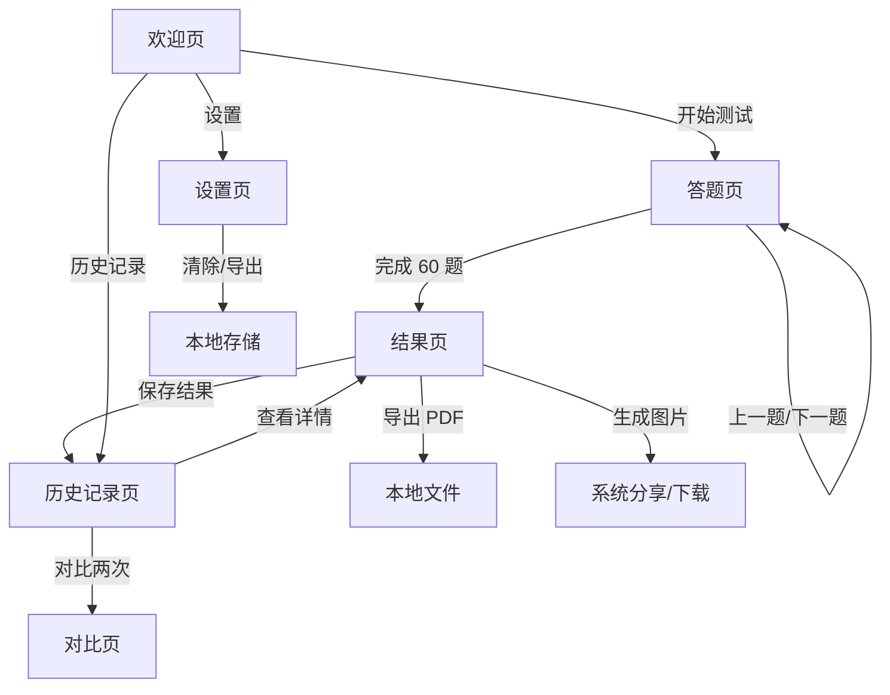

# 大五人格测试（BFI-2）产品需求文档

## 1. 产品概述

大五人格测试是一款基于 BFI-2（Big Five Inventory-2）60 题量表的纯前端人格评估应用。用户通过 5 点李克特量表作答，获得五维度及 15 个子维度的分数、雷达图可视化、个性化解读与发展建议，并支持历史记录追踪与 PDF 报告导出。所有数据仅存储在本地浏览器，保障隐私。

## 2. 核心功能

### 2.1 用户角色

| 角色 | 权限 |
|------|------|
| 匿名用户 | 完成测试、查看结果、保存历史记录、导出数据、管理本地设置 |

### 2.2 功能模块

1. **欢迎页**：产品介绍、隐私声明、大五模型简介、测试入口。
2. **答题页**：60 题 BFI-2 量表，单题单页，5 点量表，进度条与键盘导航。
3. **结果页**：五维度分数、雷达图、15 子维度解析、个性化建议、分享图片与 PDF 导出。
4. **历史记录页**：本地测试记录列表、查看详情、对比变化、删除记录。
5. **设置页**：数据管理（清除/导出）、界面设置（深色模式、字体大小）、关于与参考文献。

### 2.3 页面详情

| 页面 | 模块 | 功能描述 |
|------|------|----------|
| 欢迎页 | Hero 介绍 | 大五人格模型简介、测试时长预估、数据本地存储说明 |
| 欢迎页 | 操作入口 | "开始测试" 主按钮、"了解更多" 次级链接 |
| 答题页 | 题目展示 | 每页 1 题，题干清晰，选项 1-5 级 |
| 答题页 | 进度与导航 | 进度条、上一题/下一题、空题拦截 |
| 答题页 | 快捷操作 | 数字键 1-5 选择，Enter 下一题，方向键切换 |
| 结果页 | 维度概览 | 五维度分数（0-100）与简短解释 |
| 结果页 | 雷达图 | 五维度可视化，支持动画 |
| 结果页 | 子维度分析 | 每个维度下的 3 个子维度，共 15 个 |
| 结果页 | 发展建议 | 基于得分高低的个性化职业/人际/成长建议 |
| 结果页 | 导出分享 | 生成结果图片、保存 PDF 报告 |
| 历史记录页 | 列表 | 展示历次测试时间、五维度简览 |
| 历史记录页 | 详情/对比 | 查看单次详情或选择两次记录对比 |
| 历史记录页 | 删除 | 单条或批量删除 |
| 设置页 | 数据管理 | 清除所有本地数据、导出 JSON |
| 设置页 | 界面 | 深色/浅色模式、字体大小 |
| 设置页 | 关于 | 量表说明、参考文献、开源声明 |

## 3. 核心流程

用户进入欢迎页，了解产品后点击开始测试；在答题页依次回答 60 题，可随时返回修改；提交后进入结果页查看五维度雷达图、15 子维度分析及建议；用户可选择保存结果、分享图片、导出 PDF 或查看历史记录；在设置页可管理本地数据与界面偏好。

## 4. 用户界面设计

### 4.1 设计风格

- **整体风格**：温润、专业、内省。采用低饱和莫兰迪色系，营造安静、可信赖的心理评估氛围。
- **主色调**：暖米白 `#F7F5F2` 作为背景，深褐 `#3D352E` 作为文字与重点色。
- **强调色**：陶土橙 `#C67B5C` 用于主按钮与关键数据，苔藓绿 `#7A8B6E` 用于积极建议，灰蓝 `#6B7D8C` 用于辅助信息。
- **按钮**：主按钮为圆角矩形，填充陶土橙，悬停时轻微上移并加深阴影；次级按钮为描边样式。
- **字体**：
  - 标题：「霞鹜文楷」或系统楷体，传达人文与内省气质。
  - 正文：「思源宋体」或系统宋体，保证长文本可读性。
- **布局**：卡片式布局， generous 留白，居中单列为主，结果页采用多模块堆叠。
- **图标**：使用 lucide-react 线性图标，保持纤细、克制的视觉语言。

### 4.2 页面设计概览

| 页面 | 模块 | 设计要点 |
|------|------|----------|
| 欢迎页 | Hero | 大字标题居中，下方三栏优势说明，底部双按钮 |
| 答题页 | 题目卡 | 居中大卡片，进度条在顶部，选项横向排列，高亮选中态 |
| 结果页 | 维度卡 | 顶部雷达图，下方五维度卡片横向滚动或网格 |
| 结果页 | 子维度 | 手风琴展开，展示得分条、解释与建议 |
| 历史记录页 | 列表 | 时间线样式，每条显示测试日期与五维度 mini 雷达 |
| 设置页 | 分组 | 分组列表，开关与按钮，底部版本与开源声明 |

### 4.3 响应式设计

- **桌面优先**，最大内容宽度 720px 居中。
- 移动端自适应：答题页选项垂直排列，结果页维度卡片单列，历史记录时间线简化。
- 支持触摸滑动切换题目。

### 4.4 动效

- 页面进入：淡入 + 轻微上移（0.4s ease-out）。
- 答题切换：题目卡片横向滑入滑出。
- 结果雷达图：绘制动画（1s）。
- 分数数字：从 0 滚动到目标值（0.8s）。
- 悬停：卡片与按钮轻微放大/阴影变化。
