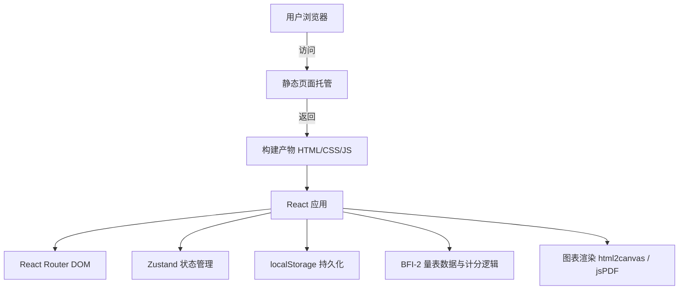

# 大五人格测试技术架构文档

## 1. 架构设计

本应用为纯前端单页应用（SPA），无后端服务。所有业务逻辑、数据计算与持久化均在浏览器端完成，通过 localStorage 保存测试历史与用户设置。构建产物为静态文件，可直接部署到任意静态页面托管服务（如 GitHub Pages、Cloudflare Pages）。



## 2. 技术选型

- **前端框架**：React 18 + TypeScript
- **构建工具**：Vite
- **样式方案**：Tailwind CSS 3
- **状态管理**：Zustand
- **路由**：React Router DOM
- **图标**：lucide-react
- **图表**：自定义 SVG 雷达图（无外部图表库依赖）
- **导出**：html2canvas（生成图片）、jspdf（生成 PDF）
- **静态部署**：构建产物输出到 `dist/` 目录，适配 GitHub Pages

## 3. 路由定义

| 路由 | 用途 |
|------|------|
| `/` | 欢迎页 |
| `/quiz` | 答题页 |
| `/result` | 结果页（展示最近一次测试结果） |
| `/result/:id` | 查看指定历史记录结果 |
| `/history` | 历史记录列表与对比 |
| `/settings` | 设置页 |
| `*` | 404 重定向到欢迎页 |

## 4. 数据模型

### 4.1 应用状态

```typescript
interface AppState {
  // 当前测试
  currentAnswers: Record<number, number>; // 题号 -> 1-5
  
  // 历史记录
  history: TestRecord[];
  
  // 设置
  settings: {
    darkMode: boolean;
    fontSize: 'small' | 'medium' | 'large';
  };
}

interface TestRecord {
  id: string;
  createdAt: number;
  answers: Record<number, number>;
  scores: DomainScores;
}

interface DomainScores {
  openness: number;         // 开放性
  conscientiousness: number; // 尽责性
  extraversion: number;      // 外向性
  agreeableness: number;     // 宜人性
  neuroticism: number;       // 神经质
  // 15 子维度
  subDimensions: {
    [key: string]: number;
  };
}
```

### 4.2 BFI-2 量表数据结构

```typescript
interface Question {
  id: number;
  text: string;
  domain: 'O' | 'C' | 'E' | 'A' | 'N';
  facet: string; // 子维度名称
  reverse: boolean; // 是否反向计分
}

const QUESTIONS: Question[] = [
  // 60 题，按 BFI-2 标准顺序
];
```

### 4.3 计分规则

- 每题原始得分 1-5 分。
- 反向计分题：转换得分 = 6 - 原始得分。
- 每个维度含 12 题，维度得分 = （该维度题目转换后总分 / 60）* 100，保留整数。
- 每个子维度含 4 题，子维度得分 = （该子维度题目转换后总分 / 20）* 100，保留整数。

## 5. 关键模块职责

| 模块 | 职责 |
|------|------|
| `src/data/questions.ts` | BFI-2 60 题数据、子维度说明、建议文案 |
| `src/utils/scoring.ts` | 计分函数、维度与子维度分数计算 |
| `src/utils/storage.ts` | localStorage 读写与版本迁移 |
| `src/utils/export.ts` | html2canvas 截图、jsPDF 生成报告 |
| `src/store/useAppStore.ts` | Zustand 全局状态 |
| `src/pages/Welcome.tsx` | 欢迎页 |
| `src/pages/Quiz.tsx` | 答题页 |
| `src/pages/Result.tsx` | 结果页 |
| `src/pages/History.tsx` | 历史记录页 |
| `src/pages/Settings.tsx` | 设置页 |
| `src/components/RadarChart.tsx` | SVG 雷达图组件 |
| `src/components/DomainCard.tsx` | 维度分数卡片 |
| `src/components/FacetAccordion.tsx` | 子维度手风琴 |

## 6. 部署方案

- 执行 `npm run build` 生成 `dist/` 目录。
- 配置 `vite.config.ts` 中 `base: './'`，确保相对路径在静态托管中正常加载。
- 可选：在 GitHub Actions 工作流中自动构建并推送到 `gh-pages` 分支。
- 构建产物不含任何后端接口或环境变量，完全静态。
